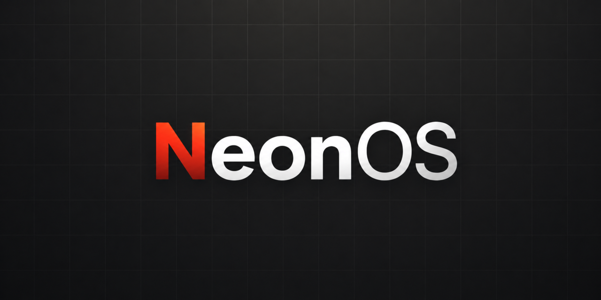

# NeonOS

A bare-metal, single-threaded operating system. Written in C and minimal assembly. Lua is the primary programming language exposed to the user.

Boots without UEFI. No Linux. No runtime dependencies.

---

## Features

- Boots from scratch without UEFI or bootloader abstraction
- FAT16 filesystem support via FatFs (up to 1 GB)
- PS/2 keyboard input
- Interactive shell with built-in commands
- Lua scripting environment with native APIs for graphics, input, and filesystem

---

## Shell Commands

| Command | Description |
|---|---|
| `help` | Show all available commands |
| `pwd` | Print current directory |
| `cd <path>` | Change directory |
| `ls [path]` | List directory contents |
| `mkdir <path>` | Create a directory |
| `cat <file>` | Print file contents |
| `write <file> <text>` | Write text to a file (overwrites) |
| `append <file> <text>` | Append text to a file |
| `rm <path>` | Remove a file or empty directory |
| `mv <old> <new>` | Rename or move a file |
| `echo <text>` | Print text to console |
| `lua <script>` | Run a Lua script |
| `path` | Show or edit the program search path (like PATH in classic systems) |
| `alias` | Add or remove file associations |
| `open <file>` | Open a file using its alias association |
| `sh <script>` | Run a shell script |
| `package <subcommand>` | Install, uninstall, or list packages |

---

## Lua API

NeonOS exposes seven native modules to Lua programs.

### `gfx` — Graphics

```lua
gfx.width()                            -- framebuffer width in pixels
gfx.height()                           -- framebuffer height in pixels
gfx.clear(color)                       -- fill the screen with a color
gfx.pixel(x, y, color)                 -- draw a single pixel
gfx.line(x0, y0, x1, y1, color)        -- draw a line
gfx.rect(x, y, w, h, color)            -- draw a rectangle outline
gfx.fill_rect(x, y, w, h, color)       -- draw a filled rectangle
gfx.text(x, y, text, color [, scale])  -- draw text (scale 1–32, default 1)
gfx.present()                          -- flush framebuffer to screen
```

Colors are 32-bit integers in `0xRRGGBB` or `0xAARRGGBB` format.
Coordinates range from −4096 to 4096.

### `input` — Keyboard

```lua
input.poll()              -- returns key_code, modifiers (or nil if no event)
input.poll_latest()       -- drains the queue, returns only the most recent event
input.pressed(key_code)   -- true if the given key was pressed this frame
input.any_pressed()       -- true if any key was pressed this frame
```

**Key constants:**

```lua
-- Letters: input.A through input.Z
input.LEFT,  input.RIGHT, input.UP,   input.DOWN
input.HOME,  input.END,   input.DELETE
input.PAGE_UP, input.PAGE_DOWN, input.INSERT
input.ENTER, input.BACKSPACE, input.TAB, input.SPACE
input.ESCAPE
input.F1, input.F2, input.F3,  input.F4
input.F5, input.F6, input.F7,  input.F8
input.F9, input.F10, input.F11, input.F12
```

**Modifiers table** (returned by `input.poll()` and `input.poll_latest()`):

```lua
local key, mods = input.poll()
if key and mods.ctrl and key == input.S then
    -- Ctrl+S
end
-- mods.shift, mods.ctrl, mods.alt (booleans)
```

Input is frame-locked: one event is consumed per `gfx.present()` call.
`poll_latest()` is useful for fast-repeat scenarios (e.g. scrolling) where only the last held key matters.

### `shell` — Shell

```lua
shell.exec(command)                -- execute a shell command string, returns exit status
shell.exec_capture(command)        -- execute a shell command string, returns exit status, output
shell.run_script(path)             -- run a shell script file, returns exit status
shell.run_script_capture(path)     -- run a shell script file, returns exit status, output
```

`exec_capture` and `run_script_capture` redirect all console output into a string instead of printing it. Output is capped at 16 KB; if truncated, a `[output truncated]` marker is appended.

```lua
local status, output = shell.exec_capture("ls /")
if status == 0 then
    -- output contains the directory listing as a string
end
```

### `fs` — Filesystem

```lua
fs.list(path)                    -- returns array of entry names
fs.listInfo(path)                -- returns array of {name, size, is_dir, ...}
fs.exists(path)                  -- boolean
fs.isDir(path)                   -- boolean
fs.isReadOnly(path)              -- boolean
fs.getSize(path)                 -- file size in bytes
fs.attributes(path)              -- {size, is_dir, readonly, hidden, system, archive}
fs.makeDir(path)                 -- create directory
fs.delete(path)                  -- delete file or directory tree
fs.copy(source, destination)     -- copy file or directory tree
fs.move(source, destination)     -- move/rename
fs.rename(source, destination)   -- alias for fs.move
fs.getName(path)                 -- last path component
fs.getDir(path)                  -- parent directory
fs.combine(...)                  -- join path components
fs.getFreeSpace(path)            -- free bytes on volume
fs.getCapacity(path)             -- total volume capacity in bytes
```

Paths accept both Unix-style (`/folder/file.lua`) and FatFs-style (`0:/folder/file.lua`) notation.

### `npackages` — Package Manager

```lua
npackages.info(id_or_path)   -- returns package info table, or nil, error
npackages.path(id_or_path)   -- returns package root path string, or nil, error
npackages.list()             -- returns array of package info tables, or nil, error
```

`id_or_path` can be a package name (e.g. `"myapp"`) or a filesystem path containing `/`, `\`, or `:` (e.g. `"0:/packages/myapp"`).

The info table contains:

```lua
{
    id          = "myapp",           -- internal package identifier
    path        = "0:/packages/myapp",
    name        = "My App",          -- display name
    version     = "1.0",             -- nil if not specified
    description = "...",             -- nil if not specified
    icon_path   = "0:/...",          -- nil if not specified
    icon_exists = true,              -- boolean
}
```

### `buffer` — Shared Key-Value Buffer

An in-memory key-value store for passing data between Lua programs and shell scripts within a session.

```lua
buffer.set(key, value)    -- store a string value; returns true or nil, error
buffer.get(key)           -- retrieve a value; returns string or nil
buffer.take(key)          -- retrieve and remove a value; returns string or nil
buffer.clear(key)         -- remove a key; returns true (found) or false (not found)
buffer.exists(key)        -- returns true if key is present
buffer.clear_all()        -- remove all keys
```

Clipboard (a dedicated single-slot buffer):

```lua
buffer.clipboard_set(value)   -- store clipboard string; returns true or nil, error
buffer.clipboard_get()        -- returns clipboard string or nil
buffer.clipboard_clear()      -- clears clipboard; returns true or false
```

### `bitmap` — Image Loading and Drawing

Loads and draws bitmap images. Returns a bitmap object on success, or `nil, error` on failure.

```lua
local img, err = bitmap.load(path)  -- load an image file; returns bitmap object or nil, error
```

Bitmap object methods:

```lua
img:draw(x, y [, scale])  -- draw image at position; scale >= 1 (default 1)
img:width()                -- image width in pixels
img:height()               -- image height in pixels
img:size()                 -- returns width, height
```

The supported image format is `.pkicn` (see [File Formats](#file-formats)).

---

## File Formats

### `.npkg` — Package Archive

Packages are distributed as `.npkg` archives. Install them with the `package` shell command:

```
package install myapp.npkg
package install myapp.npkg custom-name   -- install under a different name
package list
package uninstall myapp
```

Once installed, packages can be opened with the `open` command or queried from Lua via `npackages`.

Each package contains a `package.txt` manifest in its root directory:

```ini
name=Notes
version=1.0.0
description=Text Editor
icon=icon.pkicn
```

| Field | Required | Description |
|-------|----------|-------------|
| `name` | yes | Display name shown to the user |
| `version` | no | Version string (e.g. `1.0.0`) |
| `description` | no | Short description |
| `icon` | no | Path to icon file relative to package root (`.pkicn` format) |

### `.pkicn` — Neon Icon / Bitmap Image

A simple custom binary format for images. Structure:

| Offset | Size | Description |
|--------|------|-------------|
| 0      | 4    | Magic: `PKIC` |
| 4      | 2    | Version (must be `1`) |
| 6      | 2    | Width in pixels |
| 8      | 2    | Height in pixels |
| 10     | 2    | Flags (must be `1`) |
| 12     | w×h×4 | Pixel data: packed `0xAARRGGBB` (little-endian) |

Pixels with alpha = 0 are treated as transparent and skipped during drawing.

---

## Example Lua Program

```lua
local w = gfx.width()
local h = gfx.height()

while true do
    gfx.clear(0x000000)
    gfx.text(10, 10, "Hello from NeonOS!", 0x00FF00)
    gfx.present()

    local key = input.poll()
    if key == input.ESCAPE then
        break
    end
end
```

---

## Status

R&D / experimental. APIs are subject to change.
